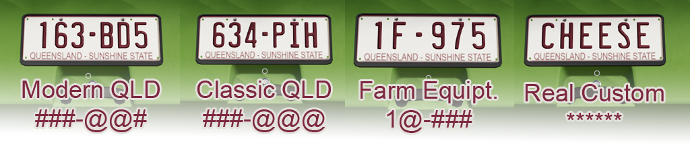

# FS22 Australian License Plates
Australian Number Plates for Farming Simulator 22 Map Makers to use in their custom maps

Feel free to use these in any custom map you make for FS22.
You don't need to credit me.

NOTE: Only ONE set of state plates can be in a map at once. you can't have multiple sets. or, at least, i've not been able to find a way.
Also, It doesn't seem like you can make a license plate mod as a standalone mod. they seem to only work INSIDE a map file.

# TODO:
This order could change, depending on requests.
- [x] **1. DONE: New South Wales.**

  NSW Plates Styles:
      
- [x] **2. DONE: Western Australia**

  WA Plates Styles:
      
- [x] **3. DONE: Victoria**

  Vic Plates Styles:
      
- [x] **4. DONE: South Australia**

  SA Plates Styles:
      
- [x] **5. DONE: Queensland**

  QLD Plates Styles:
      
- [x] **6. DONE: Northern Territory**

  NT Plates Styles:
      
- [x] **7. DONE: Tasmania**

  Tas Plates Styles:
      
- [x] **8. DONE: Australian Capital Territory**

  ACT Plates Styles:
      
- [x] **9. DONE: Adjust Colours of plate text to better match background colours.**

- Apparently the colour calculator here [https://assets.mantrid.net/colour/](https://assets.mantrid.net/colour/) is (at a guess 20%) too dark. (SA / NSW Unaffected, as they both use Black)

New Screenshots coming soon.

# KNOWN ISSUES:
- If you apply a set of plates with less style variations than the map already had, you may find the style box is blank - This is a game issue, not an issue with the mod.
     To fix this, simply purchase a vehile with whatever plate you're given, then close and reopen the store, and all the plate styles will now be there and be functioning properly.

- NPC Traffic Plates only work if your map was originally based on MapUS. For example; If replacing plates on a map based on MapFR Player owned vehicle plates will be the Australian style, NPC Traffic will not.
     No known solution at this time.

## Credits:
- Daniel "DazzaJay" Fitzgerald
- https://wwwPotholeStudios.com
