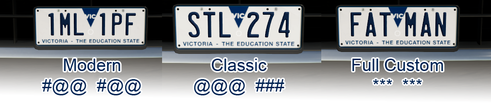

# FS22 Australian License Plates
Australian Number Plates for Farming Simulator 22 Map Makers to use in their custom maps

Feel free to use these in any custom map you make for FS22.
You don't need to credit me.

NOTE: Only ONE set of state plates can be in a map at once. you can't have multiple sets. or, at least, i've not been able to find a way.
Also, It doesn't seem like you can make a license plate mod as a standalone mod. they seem to only work INSIDE a map file.

# TODO:
This order could change, depending on requests.
- [x] **1. DONE: New South Wales.**

  NSW Plates Styles:
      
- [x] **2. DONE: Western Australia**

  WA Plates Styles:
      
- [ ] **3. DONE: Victoria**

  Vic Plates Styles:
      
- [ ] :arrow_right: **4. IN PROGRESS: South Australia**
- [ ] **5. Coming Soon: Queensland**
- [ ] **6. Coming Soon: Northern Territory**
- [ ] **7. Coming Soon: Tasmania**
- [ ] **8. Coming Soon: Australian Capital Territory**

## Credits:
- Daniel "DazzaJay" Fitzgerald
- https://wwwPotholeStudios.com
